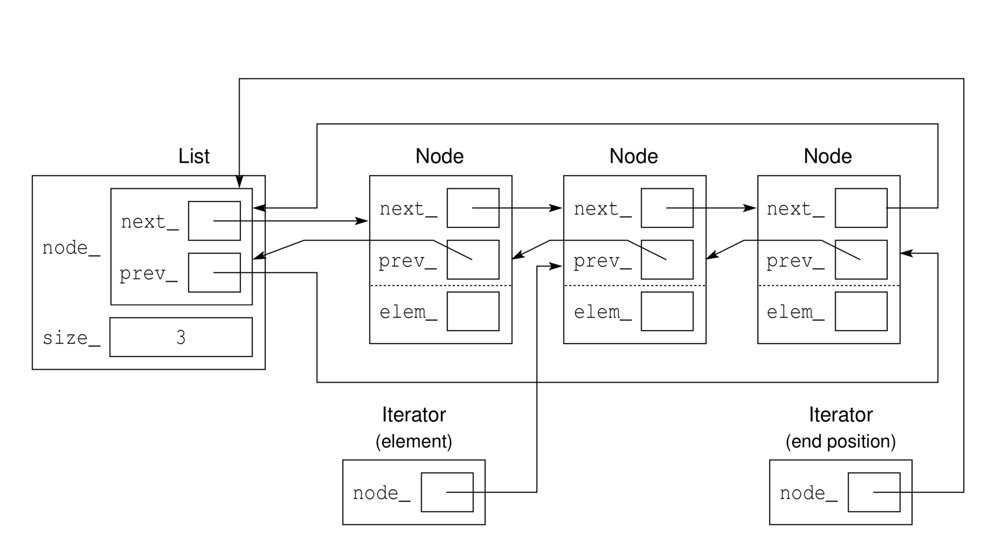
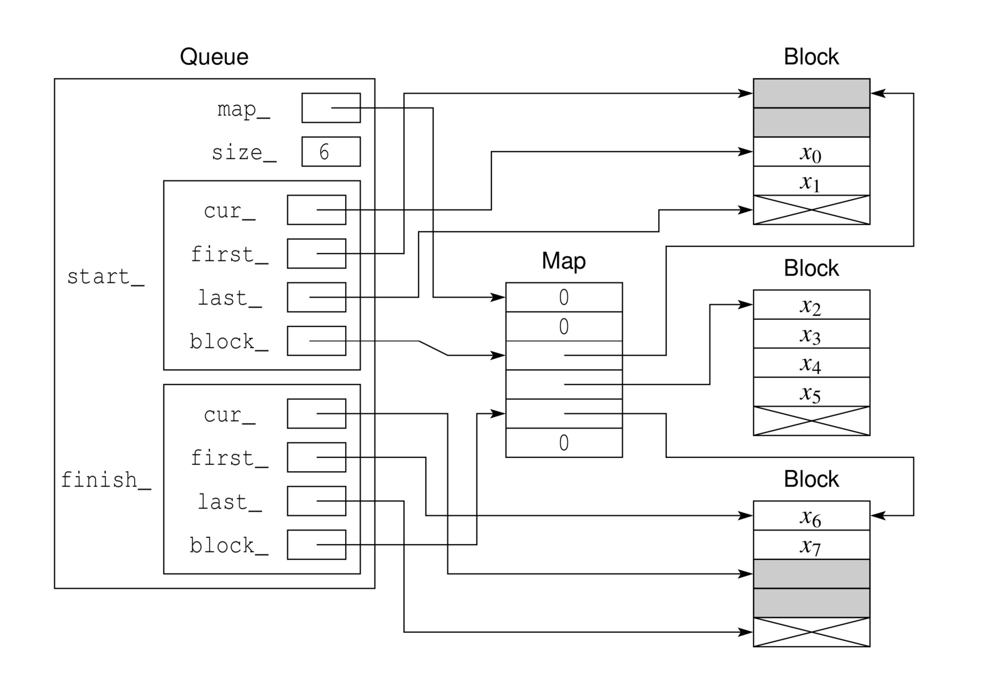
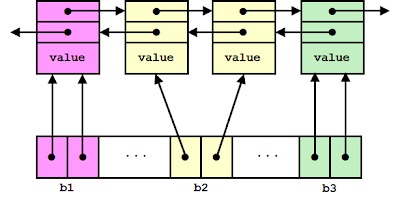
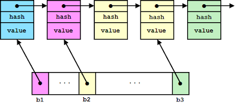

# C++ STL container library implementation

## Overview

This library implements STL containers in efficient and understandable codes. The purpose of writing this library is to practise and study. The main knowledge used in this library is: memory management, template programming, object-oriented programming. 

The APIs for each container corresponds those in C++ standard library. The author tries his best to achieve the same robustness and efficiency as the C++ standard library, so that this library can be used in a practical project (although it's usually undesirable to use a library over the standard one). If you're also trying to figure out how standard library works, but often gets bugged by the source code, this library might be of great help to you.

## Build instructions

This is a static library using cmake. To use this library, just link it with your executable.
```cmake
target_link_libraries(${target_name} container_library)

```

If you're only going to test the library, the library provides codes that do the tests. To build the test project, unquote the last two lines in `CMakeLists.txt` as instructed, and try the following lines in the top directore:
```
mkdir build
cd build
cmake ..
make
```

## Container lists

- [x] [vector](#vector)
- [x] [list](#list)
- [x] [deque](#deque)
- [x] [unordered_set](#unordered_set)
- [X] [unordered_map](#unordered_map)
- [ ] rbtree
- [ ] set
- [ ] map 

## Namespaces
`sc::regular` includes the regular containers of the library.

`sc::utils` includes several Object-Oriented utilities designed for container implementation. They are random-access (array) iterator, list iterator, deque iterator, list node, tree node. `rbtree` which is a red-black tree, should've been in this namespace. However, as it's can be used as a container, it is moved to the `sc::regular` namespace.

`sc::intrusive` include intrusive containers. *To be implemented*

`sc::lock_free` include lock_free containers. *To be implemented*

## Interfaces

The interfaces strictly follows the standard library, which can be view at [cppreference.com](https://en.cppreference.com/w/cpp/container), in the container library section. 

The APIs follow a specific convention, which will be discussed respectively below. If standard differs for a specific function, I implemented the latest (up to **C++ 17** standard). For example, the `insert` function's first parameter is a `iterator` type before **C++ 11**, however it was changed to `const_iterator` afterwards. This library only implements the latest version. (i.e., the first parameter of which is `const_iterator`).

Because the containers implements in the same way as the standard library, the iterators/references validations are the same as standard. That is, resize of `vector` invalidates iterator/references; Modifications of other containers don't generally has this setback. A detailed explanation will be presented below.

All implementations has the same complexity as standard library.

#### limitations

- Allocator template parameter and construction from initializer list are not supported.
- Strong exception guarantee strictly follows the standard. No-throw guarantees are not perfectly implemented. For example, the `erase` function of `unordered_set` does not has no-throw guarantee compared to standard because I chose Dinkumare's implementations. However, the most necessary no-throw functions such as move constructors, swap are implemented. 
- `emplace`, `emplace_back` are left unimplemented
- 'sort' functions for `list` class are left unimplemented until `ubtree` is implemented.


#### constructor, assignment operator and destructor

- Default constructors. The constructors maybe overloaded by different parameters for different container types. The most common default constructor takes in a `count` parameter which specifies the container size. 
- Construct from a range specified by two InputIterator of `[first, last)`
- copy constructor, move constructor
- copy/move assignment operator. The recently implemented containers use a **copy-and-swap idiom**<sup>[1](#copy-and-swap idiom)</sup>

#### element access, iterators
- Array-based containers(`vector, deque`) provide random access functions `operator []` and `at()`.
- Sequence containers provide `front()` and `back()` functions.
- All containers provide `begin()` and `end()` functions which returns a `iterator`/`cost_iterator` to the begin or end element. 

#### Capacity
- `empty()` returns boolean value indicates whether the container is empty
- `size()` returns the number of elements in the container, while `capacity()` returns the maximum elements the current storage can hold. In some containers, `max_size()` has the same effect as `capacity()`
- `reserve()` reserves a specified storage, it has no effect if the specified memory storage is less than current allocation. `shrink_to_fit()` truncates the extra allocated memory

#### Modifiers
- `clear()` clears all elements, memory allocation unchanged
- `insert()` inserts at a specified `const_iterator` location. references/iterators of `vector` will be invalidated after this function.
- `emplace()` construct the element in-place. references/iterators of `vector` will be invalidated after this function. `emplace_back()` doesn't invalidate reference/iterators.
- `push_back()`,`pop_back()` doesn't invalidates reference/iterators for all functions.
- `push_front()`,`pop_front()` apply to `deque` and other node-based containers.
- `resize()` if the new size is larger than current, new memory allocated; if the new size is smaller, extra contents are truncated. 
- `swap()` swap the elements of two containers. Provides no-throw guarantee.
- `erase()` erase the element at the location specified by a `const_iterator`. Not provided for `vector`

#### Non-member functions
- compare operators `>`, `<`, `>=`, `<=`. Lexically compare the elements in two containers. If two containers has the same number of elements, each element is compared in a forward order. The first un-equal element decides the result.
- `operator==()`,`operator!=()` compares whether the elements are exactly the same. For associative containers, the comparator and equal functions are also compared.
- `std::swap()` effectively use the `swap()` function

#### Operations (only for list)
- `merge()` merge two sorted lists
- `splice()` moves elements from another list
- `remove()` removes an element based on value
- `reverse()` reverse the order of elements
- `unique()` removes duplicates 
- `sort()` sorts the elements

#### Bucket interface (only for unordered associative containers)
- local `begin()` and `end()` functions which points to the begin and end of a bucket.
- `bucket_count()` returns the number of buckets
- `max_bucket_count()` returns the maximum number of bucket, it's effectively the length of array for buckets
- `bucket_size()` the number of elements in a bucket.

#### Hash policy (only for unordered associative containers)
- `load_factor()` returns the average number of elements per bucket, that is, `size()` divided by `bucket_count()`.
- `max_load_factor()` returns the value which is set on construction. Default value is `1.0`, can be overloaded with a parameter which changes the `max_load_factor`
- `rehash()` effectively reallocates the array of **buckets**. Automatically invokes when `load_factor()` reaches the maximum. This regenerates the hash table.
- `reserve()`reserves space for at least the specified number of **elements**. This regenerates the hash table. 
- `hash_function()` returns the hash function.
- `key_eq()` returns the function used to compare keys for equality.

## Implementation details

### vector

Vector is implemented by allocating a fixed-length chunk of memory, and construct the object elements in that memory. 
 `::operator new[]` takes in a length and returns a `void*` which points the beginning of the chunk of memory. This function allows us to separate memory allocation and object construction, compared to using `new` operation. The benefits of this is that if construction results in exception being thrown, memory can be deallocated more effectively. Also, it's not desirable to deallocates the memory every time when the memory is to be constantly resued.
 The allocated memory is fix-length, which means that it must meet the occasion where the number of elements exceeds the memory length. In this case, a new chunk of memory is automatically allocated, which is twice the length of the original. Then, the elements are moved to the new chunk of memory using `std::uninitialized_move`. If exception thrown during the process, new allocated memory gets destructed immediately, thus providing strong guarantee. In the end, the old memory is destructed.
 After resizing, all references and iterators gets invalidated. Accessing the old references/iterators is undefined behaviour.
 
 ### list
 This is a implementation of doubly-linked list with sentinel node. A diagram<sup>[2](#mdams)</sup> of the data structure is shown below:
 
 
 
 The benefits of this implementation over standard doubly-linked list are:
 - effectively no memory cost of the sentinel node
 - list is circular and always no-empty, this eliminates special cases resulting from empty list.
 - iterator only points to the node, which reduces one pointer overhead (which points to the end in standard implementation)
 
 ### deque
 This implementation is an array of array. A diagram<sup>[2](#madams)</sup> of the data structure is shown below:
 
 
 
 The main idea of this data structure is to have a `map` which is an array stores the pointer to a `block`, and each `block` contains the elements. 
 To explain this diagram, this deque has a `map_` private member, which is effectively an array storing pointers to each block, a private member `size_`, and two private members of type `deque_iterator` which points to the start and finish element in the container.
 The type `deque_iterator` has four members. `cur_` points to the current element. `start_->cur_` points to front of the queue, `finish_->cur_` points to one-past-the-back of the queue. `first_` and `last_` points to the first and one-past-the-end location of each block. `block_` is a reverse pointer which points to it's location in `map_`
 
 The benefits of this implementation are:
 - only block pointers changed during resize, so the references to elements never gets invalidated
 - the elements are locally contiguous in memory, which is more cache friendly than node-based queue implementation.
 - The amortized time complexity of `push_back` and `pop_front` is O(1)
 
 ### unordered_set
 Unordered_set, most generally know as hash set, is implemented by a linked list (which stores keys) and an array (which stores the buckets.) This implementation makes it possible to traverse all elements efficiently compared to traditional hash map (as in Java's implementation, however, JDK 1.8 use red-black tree on occasion where bucket count exceeds 8, thus providing better efficiency for big load factors)
 This implementations has several variations<sup>[3](#unordered)</sup>. **Microsoft Visual Studio C++** standard library uses a double-linked list to store keys, and each bucket has two pointers which points to the start and end. This implementation has a problem that on the process of `erase`, if user-defined hash function throws, `erase` will throw. However, `erase` should meet no-throw guarantee according to the standard library.
 
 <br>
 
  **Boost.unordered** and **Clang's libc++** uses a singly-linked list, the bucket only has one pointer which points to the element before the start of the bucket. 
  
 <br>
 
 In order to directly utilized the `list` data structure, I used the **dinkumware's implementation**, which unavoidably lost the no-throw guarantee for `erase.`
 
 ### unordered_map
 The implementation of `unordered_map` is basically the same as `unordered_set`, except that the value type of `list` is a pair of value and key (i.e., `std::pari<key_type, value_type>`), whereas for `unordered_set` the type is `key_type`.
  
## References
<a name="copy-and-swap-idiom">1</a> https://stackoverflow.com/questions/3279543/what-is-the-copy-and-swap-idiom

<a name="madams">2</a> Michael D. Adams. 2019. (02 2019), 1695. [Lecture slides for programming in C++](https://books.google.ca/)

<a name="unordered">3</a> http://bannalia.blogspot.com/2013/10/implementation-of-c-unordered.html


